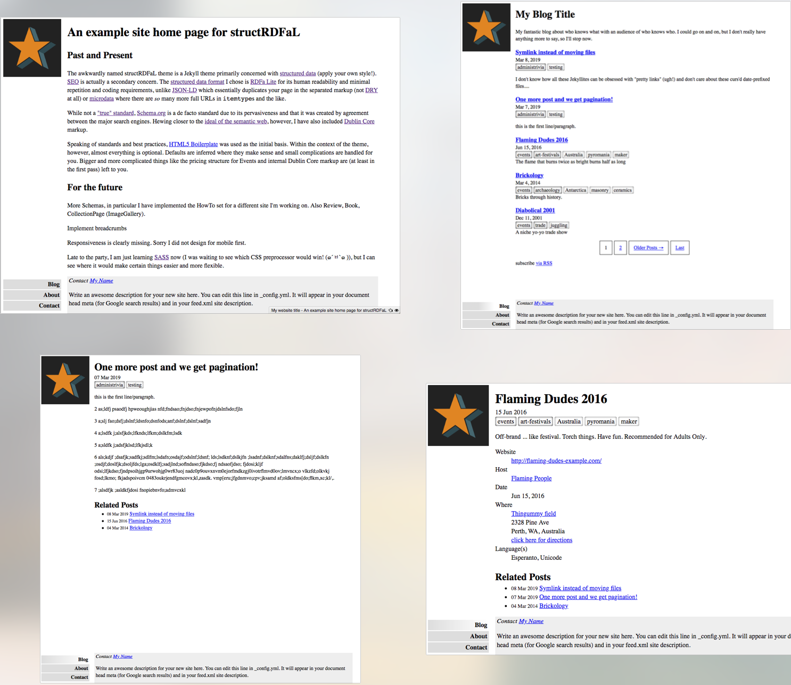

# [Structured Data RDFa Lite Jekyll theme](https://github.com/arghc/testing-repo)

[](https://jekyllrb.com/)
[](https://badge.fury.io/rb/structrdfal)

This Jekyll theme ([live demo](http://struct.arghc.ca/)) provides structured data markup in the form of [RDFa Lite](https://www.w3.org/TR/rdfa-lite/) for maximum human readability and smaller files (less repetition than [JSON-LD](https://json-ld.org/), [microdata](https://www.w3.org/TR/microdata/), or full [RDFa](https://rdfa.info/).  Additionally, for best practices purposes it is based on [HTML5 Boilerplate](https://html5boilerplate.com/) (v7.0.1), hence some additional directories (styles, scripts, html5-boilerplate-docs, .colophon) and files (.editorconfig, .htaccess, 404.html, site.webmanifest, robots.txt, humans.txt, browserconfig.xml).

The favicon.ico, icon.png, tile.png, and tile-wide.png files are images provided by HTML5 Boilerplate and left as-is so that you can get an idea for the sizes involved.  They should, of course, be replaced ASAP with images appropriate to YOUR site.

The structured data [schemas](https://schema.org/) currently implemented are WebPage (AboutPage, ContactPage), Blog, BlogPosting, and Event.

In future, I plan to
 - implement schemas: Review, Book, HowTo, and CollectionPage (ImageGallery).
 - integrate responsiveness
 - better (actually) utilize SASS.
 - implement breadcrumbs



## Installation

Add this line to your Jekyll site's `Gemfile` (note the version of paginate-v2, as of early 2019 there is a [problem](https://github.com/sverrirs/jekyll-paginate-v2/issues/150):

```ruby
gem "structRDFaL"
gem 'jekyll-paginate-v2', '2.0.0'
```

And add this line to your Jekyll site's `_config.yml`:

```yaml
theme: structRDFaL
```

And then execute:

    $ bundle

Or install it yourself as:

    $ gem install structRDFaL

## Usage
### `_layouts`
* `sitehome.html`     is a slight modification from default.html based on the idea that some of the logic needed to have just one template seemed like an unnecessary burden to put on **every** page in the site.  I may re-engineer things or just change my mind about that later.
* `default.html`      the base for everything else
* `aboutPage.html`    you should have one.  sets WebPage type for you.
* `contactPage.html`  you should have one.  sets WebPage type for you. contactform.html is included in assets if you want to modify mine
* `bloghome.html`     schema.org compliant Blog (sort of, see notes in comments), lists and paginates all your posts
* `event.html`        schema.org compliant Event page, uses the default layout.  See eventform.html for some other Event types.
* `eventpost.html`    schema.org compliant Event post, uses the BlogPosting layout.
* `page.html`         just the default generated from "jekyll new"
* `post.html`         schema.org compliant BlogPosting (sort of, see notes in bloghome)

* `autopage_category.html`
* `autopage_tags.html`  the templates that paginate-v2 autopages expect.

### `_includes`

* `blogList.html`    implements pagination-v2 logic and uses autopages for tags and categories
* `catag.html`	 where the list of linked categories and tags are generated
* `catag-old.html`   before autopages, a single page list of categories, and another for tags were generated.  These links go there.
* `footer.html`      contact info for you, javascript library inclusion, google analytics
* `nav.html`	 site navigation included on each page.  the current page link is disabled for proper usability.

### `assets`
Everything in the assets directory should be moved out to the root directory of your site where they are EXPECTED (.colophon is optional and just for your information).  The images are there mostly for your sizing reference when you create your own.  Obviously, customize away, nothing needs to remain as-is.

There is only a slight (real) difference between HTML5 Boilerplate's `404.html` and the one that Jekyll generates when you create a new instantiation, so what you want to do there is entirely up to you.

Actually, `eventform.html` and `contactform.html` are forms that I use on my sites to capture data from the public, feel free to mod and use if you're incorporating Events or don't have any other contact type plans.  Also tag.html and category.html are used in conjunction with catag-old.html

### `_sass`
I'm just learning Sass, so the only thing in `_sass` directory is the pieces for `normalize-scss`, read about it in the `.colophon`

### `_config.yml`
* `title`/`sitemark`: Page titles will be created from either "sitemark - page.title" or "page.title - site.title", so config `sitemark` if so desired.
* `email`: is used in several places with nothing to prevent spammers from scraping it, you have been warned.
* `author`: is used in multiple places in the metadata.
* `scPath`: the path to your (java)scripts, I recommend `/scripts/`
* `stPath`: the path to your CSS, I recommend `/styles/`

The `jekyll-paginate-v2` plugin is expected

### These are OPTIONAL
* `specialty`:        used in `WebPage` Schema: "One of the domain specialities to which this web page's content applies."
* `google_analytics`: your Google Analytics code
* `javascriptON`:     set if you want the HTML5 Boilerplate JS recommended libraries (`main.js`, `plugins.js`, `jquery-3.3.1.min.js`, `modernizr-3.6.0.min.js`) included at the bottom of *each* page
* `copynotice`:       something like "Copyright Acme 1999 - All rights reserved." or a link to creative commons pages is fine.  ([Dublin Core usage guide](http://www.dublincore.org/documents/2001/04/12/usageguide/sectc/#rights), [Dublin Core example code](http://www.dublincore.org/documents/2001/04/12/usageguide/simple-html/#rights)).   Currently only used in metadata, I'll get around to putting it in the footer at some point.

### Per Page Frontmatter Options
* `description`:    if a `page.description` does not exist, the `site.description` is used in the metadata
* `meta-creator`:   if a page is authored by someone not the site `author`, a `page.meta-creator` can be set
* `keywords`:	  `keywords` for HTML metadata and Dublin Core, maybe later for one or another Schema (note that blogpost `tags` and `categories` are added to `keywords` for metadata purposes).
* `subject`:        similar but different from `keywords`.  ([Dublin Core usage guide](http://www.dublincore.org/documents/2001/04/12/usageguide/sectb/#subject), [Dublin Core qualifer options](http://www.dublincore.org/documents/dcmes-qualifiers/#subject))
* `creation-date`:  [Dublin Core date qualifier options](http://www.dublincore.org/documents/dcmes-qualifiers/#date) (will be integrated into the schema metadata at some point.)

Read the comments in the `default.html` layout for more options.

## Contributing
Bug reports and pull requests are welcome on GitHub at https://github.com/arghc/structRDFaL. This project is intended to be a safe, welcoming space for collaboration, and contributors are expected to adhere to the [Contributor Covenant](http://contributor-covenant.org) code of conduct.

## License
The theme is available as open source under the terms of the [MIT License](https://opensource.org/licenses/MIT).

